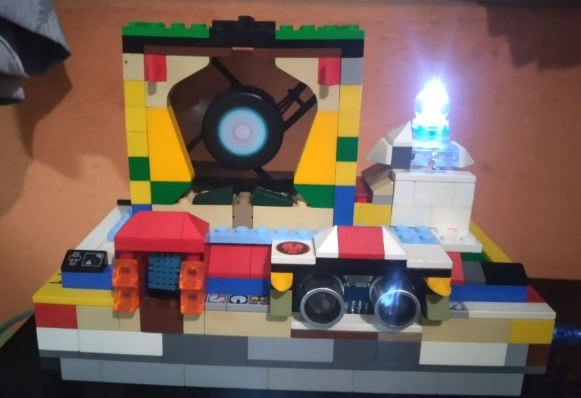

# Introducción 

###### En un mundo cada vez más conectado y enfocado en la eficiencia energética y la comodidad, la tecnología IoT (Internet de las cosas) está revolucionando la forma en que interactuamos con nuestro entorno. Uno de los campos donde esta revolución es especialmente evidente es en la creación de soluciones inteligentes para el hogar. El Proyecto 1 que presentamos se enfoca en este emocionante ámbito al proponer el desarrollo de un dispositivo de control climático para alcobas inteligentes, utilizando el análisis meteorológico en tiempo real a través de IoT.

###### El objetivo principal de este proyecto es diseñar un sistema que no solo monitoree las condiciones climáticas internas y externas de una habitación, sino que también pueda tomar decisiones inteligentes basadas en estos datos para garantizar un ambiente óptimo tanto en términos de comodidad como de eficiencia energética. Este sistema, que integra una estación meteorológica de IoT, sensores de temperatura, luz, concentración de CO2 y de proximidad, permitirá a los usuarios monitorear y controlar diversos aspectos de su habitación a través de una aplicación móvil intuitiva.

# Boceto de prototipo

# Construcción del prototipo

- sensor de gas

- modulo wifi

- Sensor temperatura y humedad

- Sensor de luz

- Proximidad y ventilador

- Iluminación

- Estructura final

# Aplicación movil

# Capas del framework de IoT

### Capa de Dispositivos y Sensores:

- En esta capa se encuentran los sensores que recopilan datos meteorológicos, como temperatura, luz, concentración de CO2 y sensores de proximidad.
- También incluye los dispositivos de control, como sistemas de iluminación y ventilación que pueden ser controlados automáticamente en función de los datos recopilados.

### Capa de Comunicación y Conectividad:

- Esta capa se encarga de establecer la comunicación entre los dispositivos y sensores y la infraestructura de IoT.
- Utiliza tecnologías de conectividad inalámbrica, como Wi-Fi, para transmitir los datos recopilados a la plataforma centralizada.

### Capa de Plataforma IoT:

- Aquí es donde se reciben, almacenan y procesan los datos recopilados de los sensores y dispositivos.
- Puede incluir una base de datos, tanto local como en la nube, para almacenar los datos de manera persistente.
- Se encarga de procesar los datos y realizar análisis, como el análisis meteorológico y la gestión de la calidad del aire.

### Capa de Aplicación Móvil:

- Esta capa proporciona la interfaz de usuario para que los usuarios monitoreen y controlen el sistema.
- Incluye funciones como visualización de datos en tiempo real, control de iluminación, temperatura y calidad del aire.

### Capa de Análisis de Datos y Lógica de Control:

- Aquí se encuentra la lógica que interpreta los datos meteorológicos recopilados y toma decisiones basadas en esos datos.
- Esto puede incluir algoritmos de análisis para predecir patrones climáticos relevantes y decisiones para controlar la iluminación, la temperatura y la calidad del aire en la habitación.

# Link del repositorio de github

[link de repositorio](https://github.com/maxwelltram/ACE2_2S23_G7 "link de repositorio")

### 
